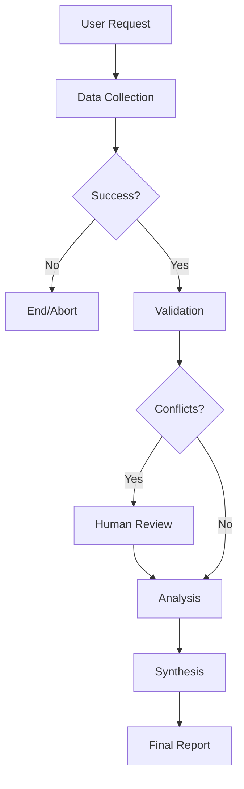

*Everything you need to record and ship the 8-episode FIntrepidQ Agent Series.*

## ⚙️ Prerequisites & Setup
Before recording, ensure the environment is ready:
- **Python:** 3.10+
- **API Keys:** `.env` must contain `OPENAI_API_KEY`, `GOOGLE_API_KEY`, and `ALPHA_VANTAGE_API_KEY`.
- **Dependencies:** `pip install -r requirements.txt`
- **Database:** `equity_ai.db` (initialized automatically on first run).


---

## 🏗️ MODULE 1: AGENTS

### 📺 EP 1 — Your First AI Agent: The ReAct Pattern
**Metadata & SEO**
- **Title:** `Build AI Agents (Ep 1/8) — Your First Python Agent`
- **🖼 Thumbnail:** Green neon "FIRST AI AGENT", brain icon, "EP 1" badge.

**The Script & Delivery**
- **The Hook:** "We're not building a script that follows a recipe; we're building a chef that knows how to use the kitchen."
- **Tone:** Discovery. Phase out 1: LLM + Tools = Agent.
- **Key Walkthrough:** `agents/data_agent.py` -> `create_react_agent`.

**Technical Deep Dive**
- **The Basics:** An AI Agent acts while a chatbot just answers. We use the **ReAct Loop** (Reason + Act).
- **Deep Dive: Why is it called ReAct?**
  The term **ReAct** stands for **Reasoning** + **Acting**. It’s a landmark AI pattern where:
  1.  **Reasoning:** The agent writes a "Thought" line, explaining *why* it needs to do something.
  2.  **Acting:** The agent performs an "Action" (a tool call) based on that thought.
  3.  **Observation:** The agent looks at the result and either finishes or repeats.

**Deep Dive: The ReAct Engine — How does it "Know"?**
How does the LLM know to follow this loop? It isn't magic; it’s **Structured Instruction**:
1.  **The Hidden Prompt:** When we call `create_react_agent`, LangGraph injects a hidden system message. It tells the LLM: *"You have these tools. If you need info, output a JSON tool call. Stop and wait for the result."*
2.  **Output Parsing:** The LLM doesn't just "act"; it outputs a specific text string (like a JSON block). The **Orchestrator** (LangGraph) sees this string, stops the LLM, and runs the actual Python function.
3.  **The Feedback Loop:** The Orchestrator then appends the tool's result to the conversation. To the LLM, it looks like it just "observed" a new fact.

**The Result:** The model is effectively "tricked" into a loop of Thinking → Calling → Observing until it decides it has the final answer.
- **The Code:**
  ```python
  from langgraph.prebuilt import create_react_agent
  agent = create_react_agent(llm, tools)
  ```
  - `{agent_scratchpad}` is the Agent's Working Memory, storing the history of tool calls so it doesn't repeat mistakes.

**🚀 Viewer Challenge:** Modify the "Hidden Prompt" in `agents/data_agent.py` to make the agent respond in a pirate voice for its reasoning steps.


---

### 📺 EP 2 — Multi-Agent Architecture & Role Separation
**Metadata & SEO**
- **Title:** `4 AI Agents, 1 Pipeline: Multi-Agent Architecture (Ep 2/8)`
- **🖼 Thumbnail:** 4 connected glowing boxes, "EP 2" badge.

**The Script & Delivery**
- **The Hook:** "One agent can get overwhelmed. We split our logic into an Analyst and a Synthesizer to ensure precision and polish."
- **Tone:** Professional. Define the roles of the 4-agent team (Data, Validation, Analysis, Synthesis).

**Technical Deep Dive**
- **The Basics:** Fixes "Context Fatigue" by assigning specialized roles.
- **The Code (`agents/analysis_agent.py`):**
  ```python
  # Preparing the specialized context
  parts = [f"FINANCIALS: {json.dumps(fins)}", f"NEWS: {json.dumps(news)}"]
  data_str = "\n\n".join(parts)
  ```
- **Foundational Concept:** Role Separation. Data Agent collects, Analysis Agent thinks, Synthesis Agent polishes.

**🚀 Viewer Challenge:** Run the pipeline for a ticker (e.g., AAPL) and check the terminal logs. Can you see exactly where the Data Agent hands off its data to the Analysis Agent?


---

### 📺 EP 3 — LangGraph: Wiring Your Agent Pipeline
**Metadata & SEO**
- **Title:** `LangGraph Tutorial: Wire Your Agent Pipeline (Ep 3/8)`
- **🖼 Thumbnail:** Flowchart with green/red/yellow paths, "EP 3" badge.

**The Script & Delivery**
- **The Hook:** "LangGraph is the backbone. It’s what keeps our agents from talking over each other."
- **Tone:** Visual. Describe edges as highways and nodes as stations.
- **Key Walkthrough:** `agents/graph.py` -> `AgentState` and `build_graph()`.

**Technical Deep Dive**
- **The Basics:** Orchestration via a Directed Acyclic Graph (DAG).
- **The Code (`agents/graph.py`):**
  ```python
  workflow = StateGraph(AgentState)
  workflow.add_node("data_collection", data_collection_node)
  workflow.add_edge("data_collection", "analysis")
  ```
- **State Lifecycle (Seed → Grow):**
  - **Seed:** State starts with just a ticker: `{"ticker": "TSLA"}`.
  - **Growth:** Agents "write" their results back into the state, expanding it over time.
- **Google SDK Analogy:** The `AgentState` is like the **Output Schema** in the Google SDK—it's the structural contract for the whole pipeline.

**Visualizing the Flow:**


**Technical Deep Dive: Human-in-the-Loop Resumption**
How do we pause a live AI pipeline and wait for a human?
1. **The Interrupt:** `workflow.compile(..., interrupt_before=["human_review"])`.
2. **The Pause:** `app.astream()` yielded events until it hit the node. The thread state is saved in `SQLite`.
3. **The Resume:** 
```python
# Resuming after human choice (from chat.py):
data_result['financial_data'] = financial_data # Human-corrected data
app.update_state(graph_config, {"data_result": data_result, "conflicts": []})

# Continue execution from the current snapshot
async for event in app.astream(None, graph_config, stream_mode="values"):
    # ... pipeline continues to final report ...
```
This pattern is essential for "Financial Guardrails."


**🚀 Viewer Challenge:** Add a new field to `AgentState` in `agents/graph.py` (e.g., `user_notes`) and see if you can pass a custom note from the start of the execution all the way to the final report.


**Deep Dive: State vs. Working Memory (Scratchpad)**
This is a critical distinction for production systems:
*   **Working Memory (`agent_scratchpad`):** This is **Internal Reasoning**. It's the agent's private "train of thought" while it works. The next agent in the pipeline **cannot see this**.
*   **State (`AgentState`):** This is **System-wide Communication**. It's the "Official Project Folder." When the Data Agent finishes, it puts its final conclusion into the State so the Analysis Agent can read it.
*   **Analogy:** Working memory is the chef's memory of what spices he just added. **State** is the actual plate of food he hands to the waiter.

---

## 🧠 MODULE 2: MEMORY

### 📺 EP 4 — Context Engineering: Prompts & Skills
**Metadata & SEO**
- **Title:** `Context Engineering: Prompts + Skills for Agents (Ep 4/8)`
- **🖼 Thumbnail:** 3 Pillars (Prompt/Skill/Memory) around a brain, "EP 4" badge.

**The Script & Delivery**
- **The Hook:** "Don't just give the agent a prompt; give it a library."
- **Tone:** Insightful. Explain "Skills" as giving the agent a textbook for an exam.
- **Key Walkthrough:** `load_skill` tool and `SKILL.md` loading logic.

**Technical Deep Dive**
- **The Basics:** Context Engineering = Right info at the right time.
- **The Hierarchy (Who vs. How vs. What):**
  - **Prompts (Who):** Permanent persona ("You are a Senior Analyst").
  - **Skills (How):** Technical manuals (loaded dynamically via `SKILL.md`).
  - **State (What):** The current facts of the stock being analyzed.

**Technical Masterclass: Data Storage & Access Patterns**
Correcting the confusion between Skills and State:
1.  **Skills (The "External Disk"):** These are accessed via the `load_skill` tool. When an agent calls this tool, it reads the file and moves that text into the **Working Memory (Scratchpad)**. You don't "save" the skill in the **State** because the next agent (e.g., Synthesis Agent) doesn't need to know *how* to analyze signals; it only needs to know the *results*.
2.  **Working Memory (The "RAM"):** This is where the Skill content lives *temporarily* while the agent is processing. Once the node finishes, the RAM is cleared.
3.  **The State (The "Official Report"):** The state is the only place where we store **Important Facts** (Prices, News) and the **Detailed Results** (the Analyst's verdict). 

**The Analogy:** If the agent is a Lawyer, the **Skill** is the law book on his shelf, the **Working Memory** is the case info he's currently reading, and the **State** is the final legal brief he submits to the judge.

**Memory Hierarchy Quick-Reference:**

| Component | Scope | Persistence | Purpose |
| :--- | :--- | :--- | :--- |
| **Prompt** | Global Persona | Static | Defines "Who" the agent is. |
| **Skills** | Specialized Docs | Dynamic (File Load) | Defines "How" to perform tasks. |
| **Working Memory** | Internal Node | Transient | Temporary reasoning scratchpad. |
| **State** | Pipeline Wide | Session | Shared facts between all agents. |
| **Database** | Global Storage | Permanent | Performance & long-term memory. |

**Technical Deep Dive: The 7 Hedge Fund Signal Categories**
We don't just ask the agent for an "analysis." We enforce a rigorous institutional framework:
1. **[FUNDAMENTAL]**: Growth/Efficiency. *Key: ROCE > 20%, ROE > 15%, FCF > 0.*
2. **[VALUATION]**: Price/Value. *Key: PEG < 1.0 (Undervalued Growth), P/E vs Industry.*
3. **[QUALITY]**: Balance Sheet. *Key: Debt/Equity < 0.5, Interest Coverage (ICR) > 3.0.*
4. **[MOMENTUM]**: Trend action. *Key: Price > SMA_200, Price < 200-Week SMA (historic entry).*
5. **[RISK]**: Volatility. *Key: Sharpe Ratio > 1.0, Beta < 1.5, VaR (95%) < 4%.*
6. **[SENTIMENT]**: Narrative. *Key: Keyword triggers like "CEO Resignation" or "SEC Inquiry".*
7. **[DIVIDEND]**: Income health. *Key: Payout Ratio < 50%, Yield > 3%.*

**🚀 Viewer Challenge:** Create a new file `docs/skills/Technical_Indicator_Manual.md`. Add instructions on how to interpret RSI. Try loading it using the `load_skill` tool during a live run.


---

### 📺 EP 5 — Database Memory & Chat Interface
**Metadata & SEO**
- **Title:** `AI Agent Memory: SQLite + Chat UI (Ep 5/8)`
- **🖼 Thumbnail:** Database cylinder with chat bubbles, "EP 5" badge.

**The Script & Delivery**
- **The Hook:** "An agent that remembers is an agent that learns."
- **Tone:** Pragmatic. Focus on persistence and human-in-the-loop saving.
- **Key Walkthrough:** `memory.py` (SQLite) and `chat.py` (Slash commands).

**Technical Deep Dive**
- **The Basics:** Short-term memory (State) vs. Long-term memory (Database).
- **The Code (`context_engineering/memory.py`):**
  ```python
  cursor.execute("INSERT INTO analysis_reports (ticker, report) VALUES (?, ?)")
  ```
- **Why it matters:** Enables institutional features like instantaneous **Sector Comparisons** (TSLA vs Ford) without re-running the agent graph.

**Database Schema (`sqlite3`):**
```sql
CREATE TABLE IF NOT EXISTS analysis_reports (
    id INTEGER PRIMARY KEY AUTOINCREMENT,
    ticker TEXT NOT NULL,
    report TEXT NOT NULL,
    created_at TIMESTAMP DEFAULT CURRENT_TIMESTAMP
);
```

**Technical Deep Dive: Memory Precedence**
In `chat_agent.py`, we implement a logic hierarchy:
- **Primary ($Database$):** The agent ALWAYS checks `get_ticker_report` first.
- **Secondary ($Web$):** It only uses `search_web` if the user asks for "latest" info or if the DB report date is stale (> 30 days).
- **This reduces API costs** and ensures we use the high-quality, pre-validated data we've already generated.

**🚀 Viewer Challenge:** The current `chat.py` saves reports. Try adding a new slash command `/history` that queries the SQLite database and lists the last 5 tickers analyzed.


---

## 🛠️ MODULE 3: TOOLS

### 📺 EP 6 — Building Agent Tools: APIs & Resiliency
**Metadata & SEO**
- **Title:** `Connect LLMs to Real APIs: Resilient Tools (Ep 6/8)`
- **🖼 Thumbnail:** @tool code + terminal output, lightning divider, "EP 6" badge.

**The Script & Delivery**
- **The Hook:** "APIs are flaky. If our agent gives up after one error, it's not production-ready."
- **Tone:** Reassuring. Build the "safety net" for agent tool calls.
- **Key Walkthrough:** `tools/definitions.py` -> yfinance tool + `@retry` decorators.

**Technical Deep Dive**
- **The Basics:** Agents are only as good as their tools. Resiliency is mandatory.
- **The Code (`tools/definitions.py`):**
  ```python
  @retry(stop=stop_after_attempt(3)) # The Safety Net
  def get_deep_financials(ticker): ...
  ```

**Deep Dive: How Agents "Connect" Instructions to Tools**
A common question: *"How does the agent know that a mention in a Skill file means a specific Python function?"*
1.  **The Names MUST Match:** If your Python function is named `get_deep_financials`, your prompt or skill file must refer to it as `get_deep_financials`.
2.  **The Registry:** In `agents/data_agent.py`, we pass a list of tools: `tools = [get_deep_financials_tool, ...]`. This is the agent's **Toolbox**.
3.  **The Mapping:** When the agent reads an instruction like "Use `get_deep_financials` to find debt," it looks in its Toolbox for a tool with that exact name.
4.  **Functions vs. Classes:** Tools can be simple Python functions (decorated with `@tool`) or complex Classes. The LLM doesn't care about the Python type; it only cares about the **Name** and the **Docstring** (which serves as the "Instruction Manual" for that specific tool).

**Foundational Concept:** Use **Backoff & Retry** and **Sanitization** (cleaning NumPy NaNs) to prevent LLM confusion.

**The Tool Registration Checklist:**
- [ ] Write the Python function.
- [ ] Add the `@tool` decorator + a clear docstring.
- [ ] Import and add the tool to the `tools` list in `agents/data_agent.py`.
- [ ] (Crucial) Refer to the tool by its **function name** in your prompts/skills.

**Developer Pattern: The Tool Contract**
```python
@tool
def get_deep_financials(ticker: str):
    """
    Fetches comprehensive financial data including revenue, PEG, and ROE.
    The docstring is the 'Instruction Manual' for the LLM.
    """
    # Logic goes here...
```


**🚀 Viewer Challenge:** Create a new tool in `tools/definitions.py` that fetches a simple "fear and greed index" (or just returns a random number 1-100). Register it and ask the agent to include this index in its data collection.


---

## ✅ MODULE 4: VALIDATION

### 📺 EP 7 — Data Models & Validation Agent
**Metadata & SEO**
- **Title:** `Quality Control for AI: Validation Agents (Ep 7/8)`
- **🖼 Thumbnail:** Shield with "95% ✓" progress bar, "EP 7" badge.

**The Script & Delivery**
- **The Hook:** "Confidence is everything. We calculate a score so we know when to trust the AI."
- **Tone:** Vigilant. Frame validation as the system's "Security Guard."
- **Key Walkthrough:** `utils/models.py` (Pydantic) and `agents/validation_agent.py`.

**Technical Deep Dive**
- **The Basics:** "Garbage In, Garbage Out." Prevents the analyst from seeing corrupt data.
- **The Code (`utils/models.py`):**
  ```python
  class Technicals(BaseModel):
      rsi: float = Field(ge=0, le=100)
  ```
  2. **Conceptual:** Is the data logically complete for a verdict?

**Validation Layer Comparison:**

| Type | Engine | Checks For... | Example |
| :--- | :--- | :--- | :--- |
| **Structural** | Pydantic | Types & Ranges | `RSI must be 0-100` |
| **Conceptual** | Validation Agent | Logic & Conflicts | `Price Up but News is Bearish?` |

**Technical Deep Dive: The Pydantic Shield**
In `utils/models.py`, we define the `FinancialData` class. This is our "Contract":
```python
class FinancialData(BaseModel):
    ticker: str
    revenue_growth: float | None = None
    return_on_capital_employed: float | None = None
    debt_to_equity: float | None = None
    # ... handles nested models like Technicals and RiskMetrics
```
This ensures that when the Data Agent returns data, if it violates the schema, the system catches it BEFORE the Analyst ever sees it.

**🚀 Viewer Challenge:** Intentionally break the data by modifying `run_data_collection` to return an RSI of `150`. Watch how Pydantic catches it and the Validation Agent reports the failure.


---

### 📺 EP 8 — Production Hardening & Course Finale
**Metadata & SEO**
- **Title:** `Build a Production Agent System: Full Demo (Ep 8/8)`
- **🖼 Thumbnail:** Holographic architect diagram, gold "FINALE" banner, "EP 8" badge.

**The Script & Delivery**
- **The Hook:** "We've built more than a demo; we've built a product."
- **Tone:** Triumphant. Ship the finished 4-pillar agent system.
- **Key Walkthrough:** `utils/cli_logger.py` (Rich) and full system run on NVDA.

**Technical Deep Dive**
- **The Basics:** Trust is built through transparency (logs) and security (sanitization).
- **The Code (`utils/cli_logger.py`):**
  ```python
  logger.tracker.start_phase("Synthesis")
  ```
- **Finale Concept:** Moving from "Hello World" to an institutional-grade multi-agent pipeline with beautiful UX.

**🎓 Graduation Challenge:** We've built the engine. Now, build the "Dashboard." Use the stored reports in SQLite to generate a simple `index.html` file that displays your trading portfoilo analysis.

---

## 🏆 FINAL SYNTHESIS: Why this is "Production-Grade"

Recording this course isn't just about building a script; it's about showing the architecture required to ship AI. Here is what we covered that moves us from "Demo" to "Product":

1.  **Structural Resiliency:** In Ep 1 & 7, we don't just "hope" the LLM works. We use **Regex JSON fixes** and **Pydantic Type Safety** to ensure the data is perfect before it reaches the analysis engine.
2.  **Stateless Persistence:** By using **LangGraph's Threading + SQLite**, our agent doesn't lose its mind if the program crashes. It can resume exactly where it left off (Ep 3 & 5).
3.  **Institutional Logic:** In Ep 4, we didn't just ask for an "analysis." We implemented a **Hedge Fund Framework** (7 categories) that enforces professional discipline on the model.
4.  **UX & Transparency:** In Ep 8, we showed that **Logs are Features**. By using `Rich` for progress tracking and detailed terminal output, we build trust with the human user.

## 📖 GLOSSARY (Agent Fundamentals)

- **Agent:** An LLM that uses a loop (like ReAct) to reason about tools and take actions autonomously.
- **Node:** A single Python function or "station" in a LangGraph workflow.
- **Edge:** The "highway" connecting nodes, often containing conditional logic (e.g., "If error, go back").
- **State:** The global "Project Folder" shared by all nodes in the pipeline.
- **Working Memory:** The agent's private "Scratchpad" while it thinks (cleared after every node).
- **Skill:** A dynamic document (like `SKILL.md`) that gives an agent temporary technical expertise for a specific task.
- **Tool:** A Python function decorated with `@tool` that allows the AI to interact with the real world (APIs, DBs).

---

## 🎁 BONUS: AGENT-IN-THE-WILD (WHATSAPP)

### 📺 BONUS EP — Build a Production WhatsApp Bot for Analysts
**Metadata & SEO**
- **Title:** `WhatsApp AI Bot: Mobile Equity Analysis (Bonus)`
- **🖼 Thumbnail:** WhatsApp icon with glowing brain, "BONUS" badge.

**The Script & Delivery**
- **The Hook:** "Why wait to get to your desk? Analyze stocks while you're waiting for coffee."
- **Tone:** Energetic. Build the bridge between Python and Node.js.
- **Key Walkthrough:** `tools/whatsapp_listener.js` and the `JSON_SEND` protocol.

**Technical Deep Dive**
- **The Problem:** Passing multiline reports over `stdin` between Python and Node is hard (newlines break things).
- **The Fix:** We wrap the whole report in a JSON object and send it as a single line.
- **Protocol Code:**
```javascript
// Node side
if (line.startsWith('JSON_SEND:')) {
    const data = JSON.parse(line.substring(10));
    await sock.sendMessage(data.jid, { text: data.text });
}
```
- **Foundational Concept:** Bidirectional Pipes. The Python script spawns a Node child process and they talk via `stdin`/`stdout`.

---
*End of Master Guide. Ship it!*

