# Portfolio Trading Agent System — Detailed Plan with Reasoning

Connect Zerodha Kite API to FIntrepidQ, automate portfolio monitoring (quarterly reports, 24/7 news), detect thesis drift, human-in-the-loop sell alerts, and persistent daemon hosting.

---

## Key Info

> [!NOTE]
> **Zerodha Kite API Personal tier is FREE** and includes portfolio management, orders, GTT, and alerts — exactly what we need. The paid Connect tier (₹500/month) adds WebSocket streaming and historical candle data, which we don't need since we use yfinance for that. You just need a Kite developer app at [kite.trade](https://kite.trade).

> [!WARNING]
> **Token refresh is manual** — Kite access tokens expire daily. The daemon must handle re-login. Two approaches:
> 1. **Selenium auto-login** (fragile, against ToS)
> 2. **Morning manual login** via browser → token cached for the day
>
> I recommend option 2 (manual morning login) for reliability.

> [!NOTE]
> **Sell execution: ALERT-ONLY** (confirmed). The system will never place orders automatically. It will only alert you with a recommendation, and you decide manually in your Kite app.

---

## How This Fits Into the Existing System

> [!TIP]
> **The portfolio agent is NOT a replacement** — it's an **extension** of your existing CLI.
> - All new commands are added to `chat.py` (e.g., `python chat.py portfolio`, `python chat.py kite login`)
> - Report generation uses the **exact same 4-agent pipeline** (Data → Validation → Analysis → Synthesis)
> - The portfolio agent simply loops through your Kite holdings and calls the existing pipeline for each stock
> - The only additions on top: your entry price/P&L as context, and a portfolio-level summary

---

## The 5 Core Problems & Their Solutions

### Problem 1: "How to access my portfolio?"
**Solution → Zerodha Kite API Broker Layer**

```mermaid
sequenceDiagram
    participant U as You (Browser)
    participant S as FIntrepidQ Daemon
    participant K as Kite API
    U->>K: Login via kite.trade redirect
    K->>S: Callback with request_token
    S->>K: Exchange for access_token
    S->>K: GET /portfolio/holdings
    K->>S: Holdings JSON (ticker, qty, avg_price, pnl)
    S->>S: Map to NSE/BSE → yfinance tickers
```

**Reasoning:** Kite Connect provides `holdings()` (long-term portfolio) and `positions()` (intraday). We need `holdings()` for investment analysis. The tricky part is NSE ticker mapping — Kite uses `RELIANCE` while yfinance uses `RELIANCE.NS`. We need a mapping layer.

---

### Problem 2: "Each company reports on different dates — how to do quarterly analysis?"
**Solution → Earnings Calendar Scheduler**

**Reasoning:** Instead of analyzing all stocks on one date, we use **event-driven scheduling**:
1. **Earnings Calendar** — Fetch from yfinance (`ticker.calendar`) to know when each company reports
2. **Pre-earnings trigger** — Run analysis 7 days before earnings (existing data baseline)
3. **Post-earnings trigger** — Run again 3 days after earnings (capture new data)
4. **Staleness check** — If no report exists within 90 days, force a refresh
5. **Result comparison** — Diff old vs. new report to detect thesis changes

This solves the "different dates" problem elegantly — the system watches each stock's calendar individually.

---

### Problem 3: "Need 24/7 news monitoring"
**Solution → News Sentinel Agent**

**Reasoning:** Your existing `search_google_news` tool already fetches news. We run it **once per day (end of day, after market close)** for all portfolio tickers:
1. Fetches news for all holdings in a single batch
2. Scores each headline for severity (uses LLM to classify as `MATERIAL` / `MINOR` / `NOISE`)
3. **Material events** → trigger re-analysis + WhatsApp alert
4. **Minor events** → log for next scheduled report
5. **Noise** → discard

Material event examples: "CEO resigns", "Fraud investigation", "Earnings miss", "Acquisition announced", "Credit downgrade"

This reuses your existing `check_strategic_triggers` tool + the sentiment keywords from `SKILL.md`.

---

### Problem 4: "Investment thesis goes wrong → sell? Need human in the loop"
**Solution → Thesis Drift Detector + Alert System**

```mermaid
graph LR
    A[New Report] --> B[Extract Verdict & Signals]
    B --> C[Compare with Previous Report]
    C --> D{Thesis Drift?}
    D -->|Verdict changed<br>BUY→SELL| E[🚨 CRITICAL ALERT]
    D -->|New red flags<br>exceeded threshold| F[⚠️ WARNING ALERT]
    D -->|Minor changes| G[📋 LOG ONLY]
    E --> H[WhatsApp + CLI Alert]
    F --> H
    H --> I{Your Decision}
    I -->|SELL| J[You sell manually in Kite app]
    I -->|HOLD| K[Acknowledge in CLI]
    I -->|No response 24h| L[Escalate: repeated Telegram]
```

**Reasoning:**
- **Thesis Drift** = when the original investment thesis (Buy reasons) is contradicted by new data
- Detected by comparing: verdict change, red flag count increase, key metric deterioration
- **Human-in-the-loop is mandatory** — the system never auto-sells
- **Escalation** — if you miss the alert, it sends repeated WhatsApp messages with increasing urgency
- Notification channels: **WhatsApp** (primary via custom listener) + CLI notification

---

### Problem 5: "Sometimes I miss to run the system"
**Solution → Persistent Daemon with Watchdog (⏳ DEFERRED TO LATER STAGE)**

**For now:** You run commands manually (`python chat.py portfolio analyze`, `python chat.py alerts`). The system works fully as CLI commands — no hosting needed.

**Later (when ready for 24/7):** We'll add a daemon + VPS hosting. The architecture is designed for this — all state is in SQLite, so adding a scheduler on top is straightforward.

---

## Proposed Changes

### Phase 1: Broker Layer (Zerodha Kite Integration)

#### [NEW] `tools/kite_client.py`
- `KiteClient` class wrapping `kiteconnect` library
- Methods: `login()`, `get_holdings()`, `get_positions()`, `get_pnl()`
- **Ticker mapping**: `RELIANCE` → `RELIANCE.NS` for yfinance compatibility
- Token caching in `.kite_session.json` (encrypted with `cryptography.fernet`)
- Flask callback server for OAuth token exchange

#### [MODIFY] `utils/config.py`
- Add `KITE_API_KEY`, `KITE_API_SECRET`, `KITE_REDIRECT_URL` from `.env`
- Add alert config: `WHATSAPP_DEFAULT_TO_NUMBER` from `.env`

#### [MODIFY] `.env.example`
- Add Kite API credentials and notification config

---

### Phase 2: Portfolio Agent + Report Generation

#### [NEW] `agents/portfolio_agent.py`
- New LangGraph agent: `PortfolioAgent`
- Orchestrates: fetch holdings → run analysis per ticker → aggregate portfolio view
- Generates per-stock reports + portfolio-level summary
- Tracks P&L per holding from Kite data

#### [NEW] `tools/portfolio_tools.py`
- `fetch_portfolio_tool` — Get holdings from Kite, map tickers
- `get_earnings_calendar_tool` — Get upcoming earnings dates per ticker
- `compare_reports_tool` — Diff two reports for same ticker, detect thesis drift
- `calculate_portfolio_metrics_tool` — Aggregate portfolio stats (total P&L, sector allocation, risk)

#### [NEW] `context_engineering/skills/portfolio_monitoring/SKILL.md`
- Skill for interpreting portfolio-level signals
- Rules for: concentration risk, sector imbalance, correlated positions, P&L thresholds
- Thesis drift detection criteria

#### [MODIFY] `context_engineering/memory.py`
- Add `portfolio_snapshots` table (holdings + P&L over time)
- Add `alerts` table (pending/acknowledged/dismissed alerts)
- Add `earnings_calendar` table (ticker, earnings_date, report_status)

---

### Phase 3: Earnings Calendar & Scheduler

#### [NEW] `tools/scheduler.py`
- Uses `APScheduler` (Advanced Python Scheduler) for cron-like jobs
- Jobs:
  - `sync_portfolio` — daily, fetch latest holdings from Kite
  - `check_earnings_calendar` — daily, update earnings dates
  - `process_earnings_queue` — when a stock's earnings date is near, queue analysis
  - `run_stale_check` — daily, find reports older than 90 days
- All job state persisted to SQLite (survives restart)

---

### Phase 4: News Sentinel

#### [NEW] `agents/news_sentinel.py`
- **End-of-day** news monitoring agent (runs once daily after market close)
- For each portfolio ticker, fetches news via `search_google_news`
- LLM-based severity classification: `MATERIAL` / `MINOR` / `NOISE`
- Material events → create alert + trigger re-analysis + Telegram notification
- Deduplication: tracks seen headlines in SQLite to avoid re-alerting

---

### Phase 5: Thesis Drift & Human-in-the-Loop

#### [NEW] `tools/alert_manager.py`
- Alert creation, escalation, and acknowledgment
- **Primary channel: WhatsApp** (free, instant, works on phone) + CLI fallback
- Uses the `JSON_SEND` protocol for high-fidelity report delivery
- Escalation: Immediate WhatsApp → repeat every 4h if not acknowledged
- Alert types: `THESIS_DRIFT`, `MATERIAL_NEWS`, `EARNINGS_UPCOMING`, `SELL_SIGNAL`
- **Alert-only mode** — never executes trades, only recommends action

#### [MODIFY] `agents/graph.py`
- Add `thesis_comparison_node` after synthesis — compares new vs. previous report
- Add `alert_node` — creates alert if drift detected
- Conditional edge: if alert created → interrupt for human review (reuse existing pattern)

---

### Phase 6: CLI Commands (now) + Daemon (later)

#### [MODIFY] `chat.py`
- Add CLI commands (usable immediately, no hosting required):
  - `python chat.py kite login` — Initiate Kite OAuth flow
  - `python chat.py portfolio` — Show current portfolio + P&L
  - `python chat.py portfolio analyze` — Run analysis on all holdings
  - `python chat.py alerts` — Show pending alerts (synchronized with WhatsApp)
  - `python chat.py alerts ack <id>` — Acknowledge an alert

#### [NEW] `daemon.py` ⏳ LATER
- Persistent background process for 24/7 monitoring
- Will be implemented when you're ready for VPS hosting

---

### Phase 7: Skill File Updates

#### [MODIFY] `context_engineering/skills/equity_trigger_analysis/SKILL.md`
- Add "Portfolio Context" section — when analyzing a stock you OWN, factor in:
  - Your entry price and current P&L
  - Cost basis impact on sell decision
  - Tax implications of holding period

#### [NEW] `context_engineering/skills/portfolio_monitoring/SKILL.md`
- Complete skill for portfolio-level analysis
- Thesis drift detection rules
- Position sizing and rebalancing signals
- Sell trigger framework with conviction scoring

---

## Architecture After Changes

---

## Implementation Order & Reasoning

### Stage A: Build Now (CLI-driven, no hosting needed)

| Phase | What | Why This Order | Est. Effort |
|-------|------|----------------|-------------|
| **1** | Kite Client | Foundation — can't do anything portfolio-related without broker data | 1 day |
| **2** | Portfolio Agent + CLI | Core value — generates reports for your actual holdings | 2 days |
| **3** | Earnings Scheduler | Solves "different dates" problem — event-driven analysis | 1 day |
| **4** | News Sentinel | News monitoring — run manually or on-demand via CLI | 1 day |
| **5** | Thesis Drift + Alerts | The "sell" decision system — WhatsApp alerts | 1.5 days |
| **6** | Skill Updates | Polish — enhances LLM decision quality | 0.5 day |

### Stage B: Later (when ready for 24/7)

| Phase | What | Est. Effort |
|-------|------|-------------|
| **7** | Daemon + VPS hosting | Background process for continuous monitoring | 1-2 days |

---

## Finalized Decisions

| Decision | Choice | Reasoning |
|----------|--------|-----------|
| **Sell execution** | Alert-only ✅ | You sell manually in Kite app |
| **Alert channel** | WhatsApp ✅ | Free (custom listener), instant, works on phone |
| **Analysis triggers** | Earnings + News only ✅ | Event-driven, not wasteful weekly runs |
| **Token refresh** | Manual morning login ✅ | Reliable, no ToS violation |
| **Hosting** | CLI-only for now, VPS later ✅ | No hosting needed — all features work as manual CLI commands |
| **Protocol** | JSON_SEND ✅ | Ensures multiline reports reach mobile correctly |

> [!IMPORTANT]
> **Why WhatsApp over Telegram?**
> Previously, we avoided WhatsApp due to Business API costs. However, our new **custom listener** built with `mudslide/Baileys` is completely free, supports the `JSON_SEND` protocol for large reports, and provides a native, seamless experience on the user's primary messaging app.

---

## Verification Plan

### Automated Tests

- `tests/test_kite_client.py` — Mock Kite API responses, test ticker mapping, test token caching
- `tests/test_portfolio_tools.py` — Test portfolio metrics calculation, report comparison
- `tests/test_scheduler.py` — Test earnings calendar parsing, job scheduling logic
- `tests/test_alert_manager.py` — Test alert creation, escalation logic

### Manual Verification
1. **Kite Login** — Run `python chat.py kite login`, complete OAuth in browser, verify token saved
2. **Portfolio Fetch** — Run `python chat.py portfolio`, verify your actual holdings appear
3. **Portfolio Analyze** — Run `python chat.py portfolio analyze`, verify reports generated for each stock
4. **Alert Flow** — Trigger a test alert, verify it shows in `python chat.py alerts`

> [!TIP]
> I recommend implementing Phase 1-2 first, testing with your real Kite account, then proceeding with the remaining phases incrementally.
